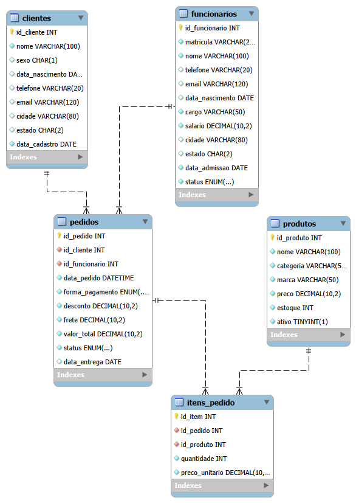
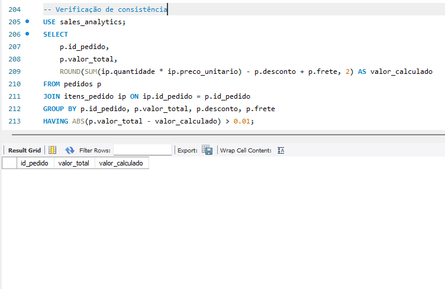
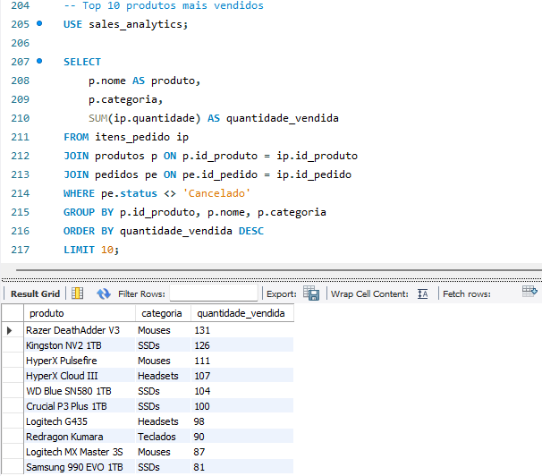
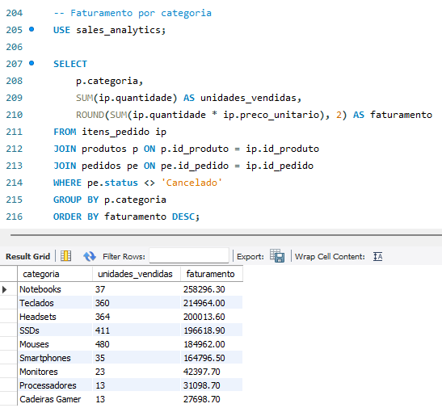
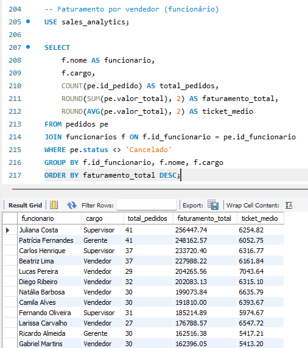
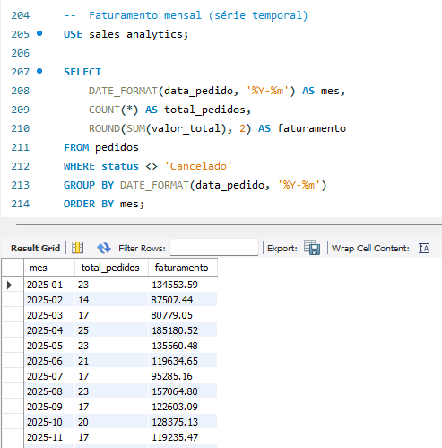

# 📊 Sales Analytics — Banco de Dados para E-commerce


Banco de dados relacional em **MySQL** simulando as operações de um e-commerce completo: clientes, produtos, funcionários, pedidos e itens de pedido. O projeto foi construído para praticar modelagem de dados, integridade referencial e escrita de consultas analíticas orientadas a perguntas reais de negócio.

> 🚧 **Em andamento:** próxima etapa é conectar esse banco ao **Power BI** para construir um dashboard de vendas interativo. Atualização em breve.

---

## 📌 Sobre o projeto

A maioria dos projetos de banco "de exemplo" usa dados soltos e aleatórios. Aqui, o objetivo foi diferente: fazer os dados se comportarem como em um **sistema de vendas real**, onde tudo se conecta e faz sentido entre si.

Na prática, isso significa que o `valor_total` de cada pedido não é um número aleatório — ele é **calculado a partir da soma real dos itens vendidos** (quantidade × preço unitário, menos desconto, mais frete). Um script de verificação, incluído no repositório, confirma que essa consistência é de **100%** em todos os 500 pedidos da base.

### Principais características

- ✅ Modelagem relacional normalizada, com chaves estrangeiras e `CHECK constraints`
- ✅ ~100 clientes, 50 produtos, 15 funcionários, 500 pedidos e mais de 1.100 itens de pedido
- ✅ `valor_total` de cada pedido validado contra a soma dos itens — diferença de **R$ 0,00** em todos os casos
- ✅ Conjunto de 15 consultas SQL respondendo perguntas reais de análise de vendas
- ✅ Script próprio de verificação de consistência dos dados

---

## 🗂️ Modelo Entidade-Relacionamento



O modelo segue uma estrutura em estrela: `clientes` e `funcionarios` se relacionam com `pedidos` (1:N), que por sua vez se relaciona com `itens_pedido` (1:N) — a mesma tabela que conecta com `produtos` (N:1). Essa modelagem é o que permite consultas analíticas ricas cruzando vendas, clientes, vendedores e catálogo.

---

## 🛠️ Tecnologias utilizadas

| Tecnologia | Uso no projeto |
|---|---|
| **MySQL 8** | Banco de dados relacional |
| **MySQL Workbench** | Modelagem, execução de scripts e diagrama ER |
| **SQL** | DDL (estrutura), DML (dados) e consultas analíticas |
| **Power BI** *(em breve)* | Dashboard interativo conectado ao banco |

---

## 📁 Estrutura do repositório

```
sales-analytics/
├── docs/
│   └── diagrama_er.png
├── 00_reset_completo.sql
├── 03_insert_clientes.sql
├── 04_insert_produtos.sql
├── 05_insert_funcionarios.sql
├── 06_insert_pedidos.sql
├── 07_insert_itens_pedido.sql
├── 08_consultas_analiticas.sql
├── 09_verificacao_consistencia.sql
└── README.md
```

| Arquivo | Descrição |
|---|---|
| `00_reset_completo.sql` | Apaga e recria o banco do zero (estrutura completa) |
| `03_insert_clientes.sql` | Inserção dos clientes |
| `04_insert_produtos.sql` | Inserção do catálogo de produtos |
| `05_insert_funcionarios.sql` | Inserção dos funcionários |
| `06_insert_pedidos.sql` | Inserção dos pedidos (valores calculados a partir dos itens) |
| `07_insert_itens_pedido.sql` | Inserção dos itens de cada pedido |
| `08_consultas_analiticas.sql` | 15 consultas de análise de vendas |
| `09_verificacao_consistencia.sql` | Verificação de integridade dos dados |

---

## ▶️ Como executar

Clone o repositório e rode os scripts **nesta ordem**, em um servidor MySQL:

```bash
mysql -u seu_usuario -p < 00_reset_completo.sql
mysql -u seu_usuario -p < 03_insert_clientes.sql
mysql -u seu_usuario -p < 04_insert_produtos.sql
mysql -u seu_usuario -p < 05_insert_funcionarios.sql
mysql -u seu_usuario -p < 06_insert_pedidos.sql
mysql -u seu_usuario -p < 07_insert_itens_pedido.sql
```

Depois, valide a integridade dos dados:

```bash
mysql -u seu_usuario -p < 09_verificacao_consistencia.sql
```

A consulta de consistência (item 3 do script) deve retornar **zero linhas** — isso confirma que todo `valor_total` bate exatamente com a soma dos itens do pedido.

---

## 📈 Exemplos de análise

O arquivo `08_consultas_analiticas.sql` traz 15 consultas prontas, cobrindo perguntas como:

- Quais os 10 produtos mais vendidos, em quantidade e em faturamento?
- Qual o ticket médio por cliente e da loja como um todo?
- Qual funcionário gerou mais faturamento?
- Como o faturamento evolui mês a mês?
- Qual a taxa de cancelamento de pedidos?
- Quais clientes compraram apenas uma vez (oportunidade de retenção)?

**Exemplo — faturamento por categoria:**

```sql
SELECT
    p.categoria,
    SUM(ip.quantidade) AS unidades_vendidas,
    ROUND(SUM(ip.quantidade * ip.preco_unitario), 2) AS faturamento
FROM itens_pedido ip
JOIN produtos p ON p.id_produto = ip.id_produto
JOIN pedidos pe ON pe.id_pedido = ip.id_pedido
WHERE pe.status <> 'Cancelado'
GROUP BY p.categoria
ORDER BY faturamento DESC;
```

**Exemplo — verificação de consistência (valor_total vs. soma dos itens):**

```sql
SELECT
    p.id_pedido,
    p.valor_total,
    ROUND(SUM(ip.quantidade * ip.preco_unitario) - p.desconto + p.frete, 2) AS valor_calculado
FROM pedidos p
JOIN itens_pedido ip ON ip.id_pedido = p.id_pedido
GROUP BY p.id_pedido, p.valor_total, p.desconto, p.frete
HAVING ABS(p.valor_total - valor_calculado) > 0.01;
-- retorna 0 linhas: 100% dos pedidos consistentes
```

---

## ✅ Resultados em ação

Prints reais executados no MySQL Workbench, direto sobre a base populada.

### Verificação de consistência — 0 linhas retornadas

Prova de que **todos os 500 pedidos** têm `valor_total` batendo exatamente com a soma dos itens vendidos.



### Top 10 produtos mais vendidos



### Faturamento por categoria



### Faturamento por vendedor



### Faturamento mensal (série temporal)



---

## 🔜 Roadmap

- [x] Modelagem do banco de dados relacional
- [x] Geração de dados consistentes (itens de pedido batendo com valor total)
- [x] Consultas analíticas de negócio
- [ ] Dashboard interativo no Power BI
- [ ] Documentação das medidas DAX

---

## 👤 Autor

**Jorge Lucas Cruz**
[https://www.linkedin.com/in/jorgelucas22/](#) · [https://github.com/trashgeorge/sales-analytics](#)
